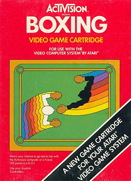

# Boxing with Reinforcement Learning
Trabalho desenvolvido para a disciplina de Reinforcement Learning 2023.2 da FGV EMAp pelos alunos Ana Carolina Erthal e Guilherme de Melo


## O jogo
O jogo faz parte dos ambientes Atari disponibilizados no Gymnasium, mas originalmente foi lançado pela Activision para o Atari 2600. O objetivo é atingir o oponente até completar 100 pontos (ou estar com a maior pontuação no final do round, que dura dois minutos) em um espaço limitado pelo ringue de boxe.

<div align="center">
	 
</div>

## O problema

No desenvolvimento do trabalho, buscamos melhorar o desempenho do jogador branco através de técnicas de Reinforcement Learning, especificamente utilizando Q-Learning.

## Regras do jogo
Num espaço limitado pelo ringue, os jogadores lutam boxe.  Cada soco acertado no outro jogador vale um ponto, e o jogador que atingir 100 pontos primeiro, vence o jogo. Caso o tempo chegue a 2 minutos (tempo limite), vence quem tiver mais pontos no momento.

## Ambiente
### Espaço de observações

Definido no Gymnasium como `Box(0, 255, (210, 160, 3), uint8)`
O espaço de observação é uma matriz 210x160x3, em que o terceiro canal define o canal RGB da imagem. Na prática, nem todo pixel da matriz é utilizável, porque o ringue de luta é limitado, então realizamos um crop removendo os 30 pixels mais externos de cada margem.  

<div align="center">
	 
</div>

### Espaço de ações

Tratamos de um espaço discreto contendo 18 possíveis ações (todas as possíveis dos ambientes Atari). É possível não realizar nenhuma ação (0), deferir o soco (1), se mover em alguma direção (2-9) ou se mover em alguma direção enquanto deferimos um soco (10-17). 

<div align="center">
	 
</div>

### Recompensas
Recompensamos o agente (jogador branco) utilizando +1 ponto quando um soco deferido atinge o oponente, e -1 quando o agente é atingido pelo oponente (leva um soco).

## Nossa abordagem de implementação
Buscando observar aprendizado por parte do agente em sua performance contra o adversário, decidimos utilizar a abordagem do Deep Q-learning, isto é, utilizar a combinação de aprendizado por reforço e aprendizado profundo produzindo uma NN que busque um valor de Optimal State-Action para o agente, aprendendo a matriz Q. Desenvolvemos dois modelos de aprendizado profundo, e também testamos as técnicas Experience Replay (produzimos previamente 2.6GB de dados utilizando o arquivo `DataGen.ipynb`) e Epsilon Greedy, produzindo no total quatro algoritmos para observação de resultados.

Para todos os modelos, utilizamos:
* _batch size_: 64
* otimizador: Adam
* _loss function_: Mean Squared Error
* _epochs_: 10, 100, 500
* _steps per epoch_: 200

Utilizamos, para todos os testes, o ambiente padrão do Atari Boxing do Gymnasium.

### CNN
A estrutura que determinamos para essa rede foi a seguinte:

```
CONV2D(32, activation=relu)
BATCH NORMALIZATION
CONV2D(32, activation=relu)
FLATTEN 
DENSE(64, activation=relu)
DENSE(18, activation=linear)
```

Para esse modelo, definimos _inputs_ simples, que representam uma única imagem, e utilizamos _samples_ aleatórias de um conjunto de dados gerado pré-treinamento. Assim sendo, não há uma noção de "movimentação" ou sequência/temporalidade para este modelo. Passamos a entrada de dados por convoluções, com a intercalação de um Batch Normalization para acelerar o treinamento, além de duas camadas densas para aumentar muito o número de parâmetros treináveis e realizar a predição na última camada. 

<div align="center">
	 
</div>

Realizamos o teste dessa rede utilizando tanto Experience Replay quanto a abordagem Epsilon Greedy.

### CNN com Stack de imagens

Para esse modelo, utilizamos a mesma estrutura de CNN que a anterior, mas realizamos um stack de 5 imagens para cada _input_ da rede. A quantidade de parâmetros treináveis aumenta pouco em relação à rede anterior, mas o objetivo era ter inputs mais significativos, com uma noção de "movimento" do agente dentro de cada input, já que capturamos uma janela de 5 possibilidades de ação. Novamente, realizamos os testes utilizando ambas as abordagens.

## Como replicar os experimentos

### Gerando os dados para Experience Replay

Para gerar os dados para Experience Replay, basta rodar o arquivo `DataGen.ipynb` ajustando o número de amostras na variável 'AMOSTRAS'. O arquivo irá gerar os dados com ações aleatórias, e salvará o arquivo `train_data.txt` no diretório `data/`.

### Criação dos modelos

Para criar os modelos, basta rodar o arquivo `CreateModel.ipynb`. O arquivo irá criar os modelos e salvá-los no diretório `models/`. Com os nomes de `model_cnn_single.h5` e `model_cnn_stack.h5`.

### Treinamento dos modelos

#### Experience Replay

Para treinar os modelos com Experience Replay, basta rodar o arquivo `TrainExp.ipynb`. O arquivo irá carregar os dados do arquivo `train_data.txt` e treinar os modelos com os parâmetros definidos no arquivo. Os modelos serão salvos no diretório `models/` com 10, 100 e 500 epochs, com os nomes de `model_cnn_single_epoch10.h5`, `model_cnn_single_epoch100.h5`, `model_cnn_single_epoch500.h5`, `model_cnn_stack_epoch10.h5`, `model_cnn_stack_epoch100.h5` e `model_cnn_stack_epoch500.h5`.

#### Epsilon Greedy

Para treinar os modelos com Epsilon-Greedy, basta rodar o arquivo `TrainEpsGreedy.ipynb`. O arquivo irá carregar os dados do arquivo `train_data.txt` e treinar o modelo com os parâmetros definidos no arquivo. O modelo será salvo no diretório `models/` com o nome de 'model_cnn_stack_epsilon_greedy.h5'.

## Referências

[1] Mnih, Volodymyr, et al. "Playing atari with deep reinforcement learning." arXiv preprint arXiv:1312.5602 (2013).

[2] MG Bellemare, Y Naddaf, J Veness, and M Bowling. “The arcade learning environment: An evaluation platform for general agents.” Journal of Artificial Intelligence Research (2012).

[3] Deep_Reinforcement_Learning-Atari GitHub repo

[4] Fedus, William, et al. "Revisiting fundamentals of experience replay." International Conference on Machine Learning. PMLR, 2020.
